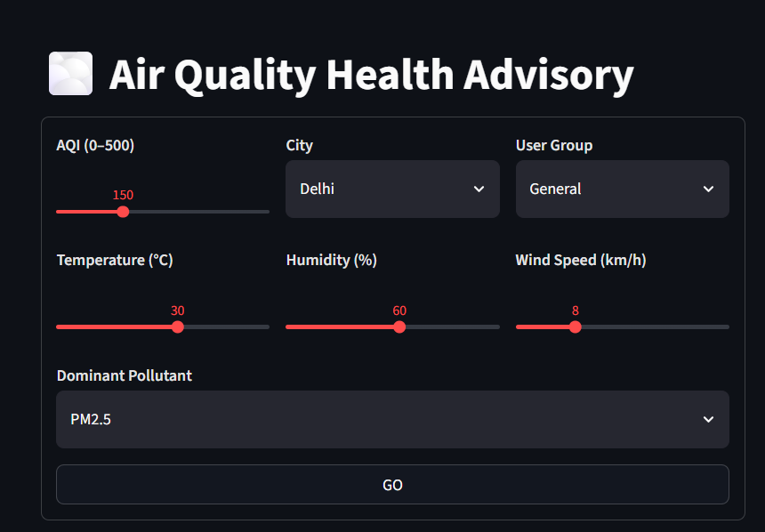
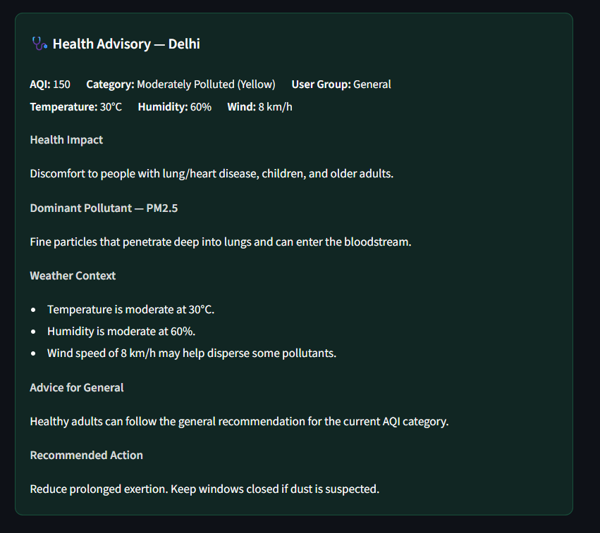

# Air Quality Health Advisory Generator

An NLP-based system that converts real-time Indian air quality data (CPCB AQI standards) into actionable, demographic-specific health advisories. Built with a complete ML pipeline including baseline classification, LSTM forecasting, and transformer-based advisory generation.

## Features

- **CPCB-Compliant Classification**: 6-tier NAQI risk categorization (Good → Severe)
- **Demographic-Aware Advisories**: Personalized for Children, Elderly, Sensitive, Asthma, General
- **Weather Context Integration**: Temperature, humidity, wind speed modifiers
- **Multi-City Support**: Bangalore, Chennai, Delhi, Hyderabad, Mumbai
- **Baseline ML Models**: Logistic Regression, Decision Tree, Random Forest, XGBoost, LightGBM
- **LSTM Time-Series Forecasting**: 7-day AQI prediction
- **Transformer Advisory Generation**: T5/BART fine-tuning for natural language output
- **Streamlit Dashboard**: Interactive advisory UI (`app/dashboard.py`)

## Project Structure

```
air-quality-advisory-generator/
├── air_quality_pipeline.py     # Complete 11-step ML pipeline
├── lstm_advisory_generator.py  # LSTM forecasting + advisory
├── aqi_advisory_generator.py   # Rule-based advisory engine
├── app/
│   └── dashboard.py            # Streamlit advisory dashboard
├── data/
│   ├── raw/                    # Original CSVs (gitignored)
│   └── processed/              # Generated datasets
├── outputs/                    # Plots, confusion matrices
├── docs/
│   └── screenshots/            # Dashboard sample screenshots
├── configs/
│   └── cpcb_standards.yaml     # CPCB breakpoint configuration
├── requirements.txt
├── .gitignore
├── README.md
```

## Quick Start

```bash
# Clone and setup
git clone https://github.com/wvpssriraj10/air-quality-advisory-generator.git
cd air-quality-advisory-generator

# Create conda environment
conda create -n aqi-env python=3.10
conda activate aqi-env

# Install dependencies
conda install -c conda-forge tensorflow pandas numpy scikit-learn matplotlib seaborn xgboost lightgbm
pip install transformers torch accelerate streamlit

# Run complete pipeline
python air_quality_pipeline.py

# Launch Streamlit dashboard
streamlit run app/dashboard.py
```

## Streamlit Dashboard

Interactive demo for generating demographic-aware health advisories:

1. Set **AQI**, **city**, and **demographic group**
2. Adjust **temperature**, **humidity**, and **wind speed**
3. Choose the **dominant pollutant**
4. Click **GO** to generate a CPCB-compliant advisory

```bash
streamlit run app/dashboard.py
```

Opens at `http://localhost:8501` by default.

### Sample Walkthrough

**1. Configure inputs** — choose AQI, city, user group, weather conditions, and dominant pollutant, then click **GO**:



**2. Read the health advisory** — results include AQI category, health impact, pollutant notes, weather context, group-specific advice, and recommended actions:



## Pipeline Steps

1. **Dataset Understanding** - 5 Indian cities, 12,605 samples
2. **Load Dataset** - CSV ingestion with error handling
3. **EDA Exploration** - Descriptive stats, missing values, class distribution
4. **Data Visualization** - 6 diagnostic plots (bar, histogram, box, heatmap)
5. **Clean & Preprocess** - Imputation, leakage-safe features, scaling, encoding
6. **Separate X/y** - Feature matrix + target vector isolated (AQI excluded)
7. **Train-Test Split** - 80/20 stratified split with rare class handling
8. **Baseline Models** - 5 classifiers trained with regularization
9. **Model Evaluation** - Precision, Recall, F1, Accuracy + macro F1
10. **Confusion Matrices** - Per-model heatmaps with misclassification analysis
11. **Model Comparison** - Ranked table + per-class metrics + per-class F1

## Sample Advisory Output

```
Delhi | AQI: 310 (Very Poor) | Group: Children
Air quality in Delhi is Very Poor (310 AQI). Respiratory illness on prolonged exposure; 
severe impact on sensitive groups. The dominant pollutant is PM2.5. 
Elevated humidity (75%) aggravates respiratory conditions. 
Children should limit outdoor activities and ensure proper ventilation indoors. 
Stay indoors with windows closed. Use air purifiers if available.
```

## Model Performance

| Model | Accuracy | Precision | Recall | F1-Score |
|-------|-----------|-----------|--------|----------|
| LightGBM | 89.88% | 89.77% | 89.88% | 89.75% |
| XGBoost | 89.81% | 89.70% | 89.81% | 89.64% |
| Random Forest | 87.66% | 88.45% | 87.66% | 87.84% |
| Logistic Regression | 79.37% | 84.65% | 79.37% | 80.21% |
| Decision Tree | 79.45% | 81.78% | 79.45% | 79.73% |

**Anti-overfitting measures applied:**
- Removed AQI from features (target leakage — `CPCB_Category` is derived from AQI)
- Injected ~18% independent measurement noise (raw pollutants were perfect linear transforms of AQI)
- Regularization: shallower trees, L1/L2 penalties, `class_weight='balanced'`, min leaf/split constraints
- Train–test gaps stay small (~0–3%), confirming generalization rather than memorization
- Minority classes (esp. Severe) remain harder; macro F1 is lower than weighted F1 as expected

## Roadmap

- [ ] LSTM 7-day forecasting in Google Colab (GPU)
- [ ] Synthetic dataset generation (3,000+ pairs)
- [ ] T5-small fine-tuning for Seq2Seq advisory generation
- [ ] Weather data integration (IMD/OpenWeather API)
- [x] Streamlit web interface (`app/dashboard.py`)
- [ ] GitHub Actions CI/CD
- [ ] Model deployment (FastAPI/Docker)

## Data Source

- Place CPCB CSVs in `data/raw/` (gitignored): `{City}_AQI_Dataset.csv`
- **CPCB Air Quality Data** (2018): Daily AQI & pollutant concentrations for 5 major Indian cities
- **Parameters**: AQI, PM2.5, PM10, NO2, SO2, CO, O3
- **Cities**: Bangalore, Chennai, Delhi, Hyderabad, Mumbai
- Generated plots land in `outputs/`; processed datasets in `data/processed/`

## License

MIT License - Feel free to use for research/education.

## Citation

If you use this in research, please cite:
```
@misc{air-quality-advisory-2024,
  title={NLP-Based Air Quality Health Advisory Generator for India},
  author={Your Name},
  year={2024},
  note={CPCB NAQI Standards Compliant}
}
```
